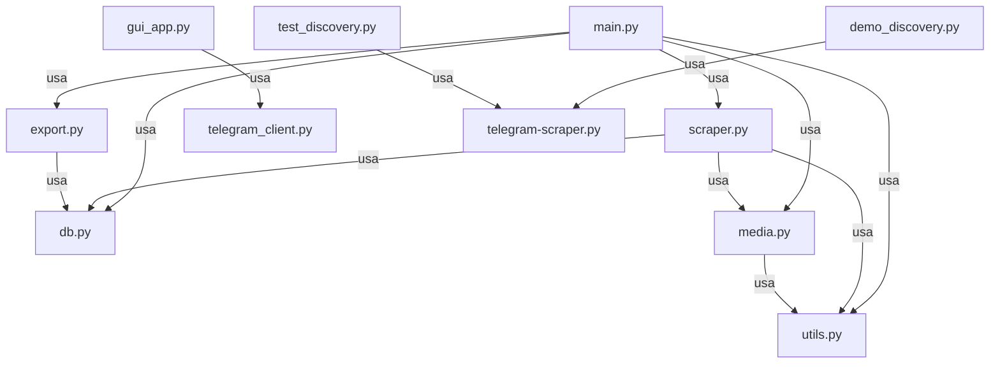

# Revisão e Refatoração Completa - Projeto Novo United

---

## Sumário
1. [Visão Geral do Projeto](#visao-geral)
2. [Estrutura de Arquivos](#estrutura-de-arquivos)
3. [Descrição dos Módulos](#descricao-dos-modulos)
4. [Fluxos Principais](#fluxos-principais)
5. [Diagrama de Dependências](#diagrama-dependencias)
6. [Principais Funções e Classes](#principais-funcoes)
7. [Pontos de Atenção e Limitações](#pontos-atencao)
8. [Sugestões de Melhoria](#sugestoes)
9. [Apêndice: Código Completo](#codigo-completo)

---

## 1. <a name="visao-geral"></a>Visão Geral do Projeto

Este projeto realiza scraping de mensagens, mídias e metadados de canais e grupos do Telegram, armazenando os dados em banco SQLite e permitindo exportação para JSON/CSV. Possui interface CLI e GUI, além de scripts auxiliares para descoberta de canais internos e testes.

---

## 2. <a name="estrutura-de-arquivos"></a>Estrutura de Arquivos

```
main.py                  # CLI principal para scraping e exportação
export.py                # Exportação de dados do banco para JSON/CSV
scraper.py               # Função assíncrona de scraping
media.py                 # Download e organização de mídias
utils.py                 # Funções utilitárias (sanitização, logs, extração de IDs)
db.py                    # Inicialização e manipulação do banco SQLite
main-scrap/telegram-scraper.py  # Script robusto de scraping e gerenciamento
main-scrap/telegram_client.py   # Classe de sessão Telegram para GUI
main-scrap/gui_app.py           # Interface gráfica (PySimpleGUI)
main-scrap/demo_discovery.py    # Demonstração de descoberta de canais internos
main-scrap/test_discovery.py    # Testes automatizados de discovery
```

---

## 3. <a name="descricao-dos-modulos"></a>Descrição dos Módulos

- **main.py**: Interface CLI principal. Permite adicionar/remover canais, iniciar scraping, exportar dados e visualizar canais salvos.
- **export.py**: Exporta todas as mensagens do banco SQLite para arquivos JSON e CSV.
- **scraper.py**: Função assíncrona para scraping de mensagens e mídias de um canal/grupo.
- **media.py**: Download de mídias, detecção de tipo e organização em subpastas.
- **utils.py**: Sanitização de nomes, extração de IDs de texto, logging de eventos.
- **db.py**: Inicialização do banco, inserção e busca de mensagens.
- **main-scrap/telegram-scraper.py**: Script completo para scraping, gerenciamento de canais, exportação, logs, retry de downloads, etc. Suporta scraping contínuo e discovery de tópicos.
- **main-scrap/telegram_client.py**: Classe para autenticação, listagem e scraping de canais, usada pela GUI.
- **main-scrap/gui_app.py**: Interface gráfica para operações comuns, baseada em PySimpleGUI.
- **main-scrap/demo_discovery.py**: Demonstração interativa de discovery de canais internos.
- **main-scrap/test_discovery.py**: Testes automatizados para discovery e normalização de IDs.

---

## 4. <a name="fluxos-principais"></a>Fluxos Principais

### a) Adição/Remoção de Canais
- Usuário insere IDs via CLI/GUI
- IDs são extraídos, normalizados e salvos em arquivo de estado

### b) Scraping de Mensagens
- Para cada canal salvo:
    - Conecta via Telethon
    - Itera sobre mensagens (reverse=True)
    - Salva texto, metadados e baixa mídias (se configurado)
    - Armazena no banco SQLite
    - Gera logs diários

### c) Exportação de Dados
- Exporta todas as mensagens do banco para JSON e CSV
- Um arquivo por canal

### d) Descoberta de Canais Internos
- Para grupos do tipo fórum, busca tópicos internos via API
- Adiciona canais internos automaticamente ao state

### e) Retry de Downloads Problemáticos
- Mantém log de falhas de download
- Permite retry automático dos arquivos que falharam

---

## 5. <a name="diagrama-dependencias"></a>Diagrama de Dependências



---

## 6. <a name="principais-funcoes"></a>Principais Funções e Classes

- **main.py**
    - `main()`: Loop principal do CLI
    - `menu()`: Exibe opções
- **scraper.py**
    - `scrape_channel(...)`: Scraping assíncrono de mensagens/mídias
- **media.py**
    - `download_media(...)`: Download e organização de arquivos
- **db.py**
    - `init_db(...)`, `insert_message(...)`, `fetch_messages(...)`
- **utils.py**
    - `sanitize_folder_name(...)`, `extract_ids_from_text(...)`, `log_event(...)`
- **main-scrap/telegram-scraper.py**
    - `manage_channels()`: Menu robusto de gerenciamento
    - `scrape_channel()`: Scraping detalhado com logs, retry, discovery
    - `discover_internal_channels()`: Busca tópicos internos
    - `retry_problematic_downloads()`: Retry de downloads com log
    - `generate_failure_report()`: Gera relatório CSV de falhas
    - `continuous_scraping()`: Scraping contínuo
    - `export_to_csv/json()`: Exportação
    - `log_diario()`: Geração de logs diários por grupo/canal
- **main-scrap/telegram_client.py**
    - `TelegramSession`: Classe para autenticação, listagem, scraping
- **main-scrap/gui_app.py**
    - Funções de interface gráfica, threading e callbacks

---

## 7. <a name="pontos-atencao"></a>Pontos de Atenção e Limitações

- **Tratamento de erros**: Muitos try/except, mas alguns prints genéricos. Padronizar logging e tratamento de exceções.
- **Duplicidade de lógica**: Funções de scraping e exportação aparecem em mais de um módulo.
- **Modularização**: Alguns scripts (ex: telegram-scraper.py) são muito grandes e multifuncionais.
- **Testes**: Testes automatizados limitados a discovery. Não há testes para scraping/exportação.
- **Configuração**: Parâmetros sensíveis (API_ID, API_HASH) hardcoded. Ideal usar .env ou config seguro.
- **Internacionalização**: Mensagens em português, mas misturadas com prints em inglês.
- **Performance**: Scraping sequencial por padrão; pode ser otimizado para paralelismo controlado.
- **Persistência de estado**: Uso de arquivos JSON para state; pode ser centralizado em banco.

---

## 8. <a name="sugestoes"></a>Sugestões de Melhoria

- Refatorar telegram-scraper.py em módulos menores (ex: state, discovery, export, logs)
- Centralizar configuração sensível em arquivo .env
- Padronizar logging (ex: usar logging do Python)
- Adicionar testes automatizados para scraping e exportação
- Melhorar tratamento de exceções e mensagens de erro
- Documentar exemplos de uso e comandos comuns
- Adicionar tipagem estática (type hints) em todas as funções
- Considerar uso de ORM para banco de dados
- Implementar interface web para gerenciamento
- Adicionar suporte a scraping paralelo com limites configuráveis

---

## 9. <a name="codigo-completo"></a>Apêndice: Código Completo

### main.py
```python
import asyncio
import os
from telethon.sync import TelegramClient
from telethon.tl.types import PeerChannel
from utils import sanitize_folder_name, extract_ids_from_text, log_event
from db import insert_message, fetch_messages
from media import download_media
from scraper import scrape_channel
from export import export_to_json, export_to_csv

# =================== CONFIGURAÇÕES =================== #
API_ID = 'SEU_API_ID'
API_HASH = 'SEU_API_HASH'
SESSION_NAME = 'scraper_session'
DOWNLOADS_BASE = 'downloads'
SEMAPHORE_LIMIT = 5
# ===================================================== #

def display_ascii_art():
    WHITE = "\033[97m"
    RESET = "\033[0m"
    art = r'''
 _                   ___                  
| |                 / _ \                 
| |     ___  ___   / /_\ \_ __  _ __  ___ 
| |    / _ \/ _ \  |  _  | '_ \| '_ \/ __|
| |___|  __/ (_) | | | | | |_) | |_) \__ \
\_____/\___|\___/  \_| |_/ .__/| .__/|___/
                         | |   | |        
                         |_|   |_|        
'''
    print(WHITE + art + RESET)

def menu():
    print("\nMenu:")
    print("[A] Adicionar canais/grupos (cole bloco de texto com IDs)")
    print("[R] Remover canais/grupos (cole bloco de texto com IDs)")
    print("[V] Ver canais salvos")
    print("[S] Scrape all channels")
    print("[E] Exportar dados (JSON/CSV)")
    print("[Q] Sair")
    return input("Escolha uma opção: ").strip().lower()

def main():
    # Dicionário de canais salvos: {id: {group_name, channel_origin}}
    if os.path.exists('channels_state.json'):
        import json
        with open('channels_state.json', 'r', encoding='utf-8') as f:
            channels = json.load(f)
    else:
        channels = {}
    while True:
        op = menu()
        if op == 'a':
            print("Cole o(s) ID(s) ou bloco de texto contendo os IDs dos grupos/canais a adicionar:")
            input_text = input()
            ids = extract_ids_from_text(input_text)
            if not ids:
                print("Nenhum ID válido encontrado.")
                continue
            with TelegramClient(SESSION_NAME, API_ID, API_HASH) as client:
                for group_id in ids:
                    try:
                        entity = client.get_entity(PeerChannel(int(group_id.split('_')[0])))
                        group_name = sanitize_folder_name(entity.title)
                        channel_origin = group_name  # Para grupos simples
                        channels[group_id] = {'group_name': group_name, 'channel_origin': channel_origin}
                        print(f"Adicionado: {group_name} (ID: {group_id})")
                    except Exception as e:
                        print(f"[ERRO] Falha ao adicionar {group_id}: {e}")
            with open('channels_state.json', 'w', encoding='utf-8') as f:
                import json
                json.dump(channels, f, ensure_ascii=False, indent=2)
        elif op == 'r':
            print("Cole o(s) ID(s) ou bloco de texto contendo os IDs dos canais a remover:")
            input_text = input()
            ids = extract_ids_from_text(input_text)
            removed = []
            for channel_id in ids:
                if channel_id in channels:
                    del channels[channel_id]
                    removed.append(channel_id)
            with open('channels_state.json', 'w', encoding='utf-8') as f:
                import json
                json.dump(channels, f, ensure_ascii=False, indent=2)
            if removed:
                print(f"Removidos: {', '.join(removed)}")
            else:
                print("Nenhum canal removido. IDs não encontrados.")
        elif op == 'v':
            if not channels:
                print("Nenhum canal salvo.")
            else:
                print("Canais salvos:")
                for cid, info in channels.items():
                    print(f"- {info['group_name']} (ID: {cid})")
        elif op == 's':
            if not channels:
                print("Nenhum canal salvo para scraping.")
                continue
            with TelegramClient(SESSION_NAME, API_ID, API_HASH) as client:
                semaphore = asyncio.Semaphore(SEMAPHORE_LIMIT)
                for cid, info in channels.items():
                    print(f"Scraping: {info['group_name']} (ID: {cid})")
                    group_folder = os.path.join(DOWNLOADS_BASE, info['group_name'], info['channel_origin'])
                    os.makedirs(group_folder, exist_ok=True)
                    db_path = os.path.join(group_folder, 'mensagens.db')
                    entity = client.get_entity(PeerChannel(int(cid.split('_')[0])))
                    asyncio.run(scrape_channel(client, entity, info['group_name'], info['channel_origin'], semaphore, db_path))
        elif op == 'e':
            print("Exportar dados de qual canal? (cole o ID ou bloco de texto)")
            input_text = input()
            ids = extract_ids_from_text(input_text)
            for cid in ids:
                if cid in channels:
                    group_folder = os.path.join(DOWNLOADS_BASE, channels[cid]['group_name'], channels[cid]['channel_origin'])
                    db_path = os.path.join(group_folder, 'mensagens.db')
                    export_to_json(db_path)
                    export_to_csv(db_path)
                else:
                    print(f"Canal não encontrado: {cid}")
        elif op == 'q':
            print("Saindo...")
            break
        else:
            print("Opção inválida.")

# Exibe o banner ao iniciar
if __name__ == "__main__":
    display_ascii_art()
    main() 
```

### export.py
```python
import sqlite3
import json
import csv
from pathlib import Path

def export_to_json(db_path, output_path=None):
    """Exporta todas as mensagens do banco para um arquivo JSON."""
    conn = sqlite3.connect(db_path)
    c = conn.cursor()
    c.execute('SELECT * FROM messages')
    rows = c.fetchall()
    columns = [desc[0] for desc in c.description]
    data = [dict(zip(columns, row)) for row in rows]
    conn.close()
    if not output_path:
        output_path = Path(db_path).with_suffix('.json')
    with open(output_path, 'w', encoding='utf-8') as f:
        json.dump(data, f, ensure_ascii=False, indent=2)
    print(f"Exportado para {output_path}")

def export_to_csv(db_path, output_path=None):
    """Exporta todas as mensagens do banco para um arquivo CSV."""
    conn = sqlite3.connect(db_path)
    c = conn.cursor()
    c.execute('SELECT * FROM messages')
    rows = c.fetchall()
    columns = [desc[0] for desc in c.description]
    conn.close()
    if not output_path:
        output_path = Path(db_path).with_suffix('.csv')
    with open(output_path, 'w', encoding='utf-8', newline='') as f:
        writer = csv.writer(f)
        writer.writerow(columns)
        writer.writerows(rows)
    print(f"Exportado para {output_path}") 
```

### scraper.py
```python
import asyncio
from pathlib import Path
from telethon.tl.types import PeerChannel
from utils import sanitize_folder_name, log_event
from db import insert_message
from media import download_media

async def scrape_channel(client, entity, group_name, channel_origin, semaphore, db_path):
    """
    Faz scraping de todas as mensagens de um canal/grupo, salva no banco e baixa mídia.
    """
    async for message in client.iter_messages(entity, reverse=True):
        try:
            # Ignorar mensagens sem texto nem mídia
            if not (getattr(message, 'text', None) or message.media):
                continue
            sender = await message.get_sender()
            sender_name = sanitize_folder_name(getattr(sender, 'username', None) or getattr(sender, 'first_name', None) or "anon")
            media_path = None
            media_type = None
            if message.media:
                media_path, media_type = await download_media(message, Path(db_path).parent / "media", semaphore)
            msg_dict = {
                'message_id': message.id,
                'date': str(message.date),
                'sender_name': sender_name,
                'group_name': group_name,
                'channel_origin': channel_origin,
                'text': getattr(message, 'text', None),
                'media_type': media_type,
                'media_path': media_path
            }
            insert_message(db_path, msg_dict)
        except Exception as e:
            log_event(f"[ERRO] Falha ao processar mensagem {getattr(message, 'id', '?')}: {e}")
            import traceback
            traceback.print_exc() 
```

### media.py
```python
import mimetypes
from pathlib import Path
import asyncio

async def download_media(message, base_folder, semaphore):
    """
    Baixa a mídia de uma mensagem do Telethon, detecta tipo/extensão e salva na subpasta correta.
    Retorna o caminho do arquivo salvo e o tipo de mídia.
    """
    guessed_name = f"{message.id}"
    mime_type = None
    if hasattr(message, 'document') and message.document and hasattr(message.document, 'mime_type'):
        mime_type = message.document.mime_type
    elif hasattr(message, 'photo') and message.photo:
        mime_type = 'image/jpeg'
    extension = mimetypes.guess_extension(mime_type or '') or '.bin'
    # Define subpasta por tipo
    media_type = 'unknown'
    if mime_type:
        if 'image' in mime_type:
            media_type = 'images'
        elif 'video' in mime_type:
            media_type = 'videos'
        elif 'audio' in mime_type:
            media_type = 'audios'
        elif 'pdf' in mime_type or 'doc' in mime_type:
            media_type = 'docs'
    final_dir = Path(base_folder) / media_type
    final_dir.mkdir(parents=True, exist_ok=True)
    full_file_path = final_dir / f"{guessed_name}{extension}"
    async with semaphore:
        result = await message.download_media(file=full_file_path)
        if result:
            return str(full_file_path), media_type
        else:
            return None, None 
```

### db.py
```python
import sqlite3
from pathlib import Path

def init_db(db_path):
    """Cria o banco e a tabela de mensagens se não existirem."""
    conn = sqlite3.connect(db_path)
    c = conn.cursor()
    c.execute('''
        CREATE TABLE IF NOT EXISTS messages (
            id INTEGER PRIMARY KEY AUTOINCREMENT,
            message_id INTEGER,
            date TEXT,
            sender_name TEXT,
            group_name TEXT,
            channel_origin TEXT,
            text TEXT,
            media_type TEXT,
            media_path TEXT
        )
    ''')
    conn.commit()
    return conn

def insert_message(db_path, msg_dict):
    """Insere uma mensagem no banco. msg_dict deve conter as chaves corretas."""
    conn = init_db(db_path)
    c = conn.cursor()
    c.execute('''
        INSERT INTO messages (
            message_id, date, sender_name, group_name, channel_origin, text, media_type, media_path
        ) VALUES (?, ?, ?, ?, ?, ?, ?, ?)
    ''', (
        msg_dict.get('message_id'),
        msg_dict.get('date'),
        msg_dict.get('sender_name'),
        msg_dict.get('group_name'),
        msg_dict.get('channel_origin'),
        msg_dict.get('text'),
        msg_dict.get('media_type'),
        msg_dict.get('media_path')
    ))
    conn.commit()
    conn.close()

# Função opcional para buscar mensagens

def fetch_messages(db_path, limit=100):
    """Busca as últimas mensagens do banco."""
    conn = sqlite3.connect(db_path)
    c = conn.cursor()
    c.execute('SELECT * FROM messages ORDER BY id DESC LIMIT ?', (limit,))
    rows = c.fetchall()
    conn.close()
    return rows 
```

### utils.py
```python
import re
import os
from datetime import datetime

def sanitize_folder_name(name):
    """Sanitiza nomes para uso seguro em pastas/arquivos."""
    if not name or not isinstance(name, str):
        return "Desconhecido"
    sanitized = re.sub(r'[\\/:*?"<>|]', "_", name)
    return re.sub(r'\s+', '_', sanitized.strip())

def extract_ids_from_text(text: str):
    """Extrai todos os IDs de canais/grupos do Telegram de um bloco de texto."""
    pattern = r'-100\d{10,}(?:_\d+)?'
    return re.findall(pattern, text)

def log_event(msg, log_file="logs/app.log"):
    """Registra eventos e erros em um arquivo de log simples."""
    os.makedirs(os.path.dirname(log_file), exist_ok=True)
    with open(log_file, "a", encoding="utf-8") as f:
        f.write(f"[{datetime.now().strftime('%Y-%m-%d %H:%M:%S')}] {msg}\n") 
```

### main-scrap/telegram-scraper.py
```python
import os
import sqlite3
import json
import csv
import asyncio
from telethon import TelegramClient
from telethon.tl.types import (
    MessageMediaPhoto,
    MessageMediaDocument,
    User,
    PeerChannel,
    ForumTopic,
)
from telethon.tl.functions.channels import GetForumTopicsRequest
from telethon.errors import FloodWaitError, RPCError
import aiohttp
import sys
import re
from datetime import datetime
from telethon.errors.rpcerrorlist import ServerError, ChannelInvalidError, ChannelPrivateError, TimeoutError
import glob
import threading
import mimetypes
from pathlib import Path

# =================== CONFIGURAÇÕES =================== #
API_ID = 'SEU_API_ID'
API_HASH = 'SEU_API_HASH'
SESSION_NAME = 'scraper_session'
DOWNLOADS_BASE = 'downloads'
SEMAPHORE_LIMIT = 5
# ===================================================== #

def display_ascii_art():
    WHITE = "\033[97m"
    RESET = "\033[0m"
    art = r'''
 _                   ___                  
| |                 / _ \                 
| |     ___  ___   / /_\ \_ __  _ __  ___ 
| |    / _ \/ _ \  |  _  | '_ \| '_ \/ __|
| |___|  __/ (_) | | | | | |_) | |_) \__ \
\_____/\___|\___/  \_| |_/ .__/| .__/|___/
                         | |   | |        
                         |_|   |_|        
'''
    print(WHITE + art + RESET)

def menu():
    print("\nMenu:")
    print("[A] Adicionar canais/grupos (cole bloco de texto com IDs)")
    print("[R] Remover canais/grupos (cole bloco de texto com IDs)")
    print("[V] Ver canais salvos")
    print("[S] Scrape all channels")
    print("[E] Exportar dados (JSON/CSV)")
    print("[Q] Sair")
    return input("Escolha uma opção: ").strip().lower()

def main():
    # Dicionário de canais salvos: {id: {group_name, channel_origin}}
    if os.path.exists('channels_state.json'):
        import json
        with open('channels_state.json', 'r', encoding='utf-8') as f:
            channels = json.load(f)
    else:
        channels = {}
    while True:
        op = menu()
        if op == 'a':
            print("Cole o(s) ID(s) ou bloco de texto contendo os IDs dos grupos/canais a adicionar:")
            input_text = input()
            ids = extract_ids_from_text(input_text)
            if not ids:
                print("Nenhum ID válido encontrado.")
                continue
            with TelegramClient(SESSION_NAME, API_ID, API_HASH) as client:
                for group_id in ids:
                    try:
                        entity = client.get_entity(PeerChannel(int(group_id.split('_')[0])))
                        group_name = sanitize_folder_name(entity.title)
                        channel_origin = group_name  # Para grupos simples
                        channels[group_id] = {'group_name': group_name, 'channel_origin': channel_origin}
                        print(f"Adicionado: {group_name} (ID: {group_id})")
                    except Exception as e:
                        print(f"[ERRO] Falha ao adicionar {group_id}: {e}")
            with open('channels_state.json', 'w', encoding='utf-8') as f:
                import json
                json.dump(channels, f, ensure_ascii=False, indent=2)
        elif op == 'r':
            print("Cole o(s) ID(s) ou bloco de texto contendo os IDs dos canais a remover:")
            input_text = input()
            ids = extract_ids_from_text(input_text)
            removed = []
            for channel_id in ids:
                if channel_id in channels:
                    del channels[channel_id]
                    removed.append(channel_id)
            with open('channels_state.json', 'w', encoding='utf-8') as f:
                import json
                json.dump(channels, f, ensure_ascii=False, indent=2)
            if removed:
                print(f"Removidos: {', '.join(removed)}")
            else:
                print("Nenhum canal removido. IDs não encontrados.")
        elif op == 'v':
            if not channels:
                print("Nenhum canal salvo.")
            else:
                print("Canais salvos:")
                for cid, info in channels.items():
                    print(f"- {info['group_name']} (ID: {cid})")
        elif op == 's':
            if not channels:
                print("Nenhum canal salvo para scraping.")
                continue
            with TelegramClient(SESSION_NAME, API_ID, API_HASH) as client:
                semaphore = asyncio.Semaphore(SEMAPHORE_LIMIT)
                for cid, info in channels.items():
                    print(f"Scraping: {info['group_name']} (ID: {cid})")
                    group_folder = os.path.join(DOWNLOADS_BASE, info['group_name'], info['channel_origin'])
                    os.makedirs(group_folder, exist_ok=True)
                    db_path = os.path.join(group_folder, 'mensagens.db')
                    entity = client.get_entity(PeerChannel(int(cid.split('_')[0])))
                    asyncio.run(scrape_channel(client, entity, info['group_name'], info['channel_origin'], semaphore, db_path))
        elif op == 'e':
            print("Exportar dados de qual canal? (cole o ID ou bloco de texto)")
            input_text = input()
            ids = extract_ids_from_text(input_text)
            for cid in ids:
                if cid in channels:
                    group_folder = os.path.join(DOWNLOADS_BASE, channels[cid]['group_name'], channels[cid]['channel_origin'])
                    db_path = os.path.join(group_folder, 'mensagens.db')
                    export_to_json(db_path)
                    export_to_csv(db_path)
                else:
                    print(f"Canal não encontrado: {cid}")
        elif op == 'q':
            print("Saindo...")
            break
        else:
            print("Opção inválida.")

# Exibe o banner ao iniciar
if __name__ == "__main__":
    display_ascii_art()
    main() 
```

### main-scrap/telegram_client.py
```python
from telethon import TelegramClient
from telethon.tl.types import Channel, PeerChannel
from telethon.errors.rpcerrorlist import ChannelInvalidError, ChannelPrivateError, FloodWaitError, ServerError, TimeoutError
import asyncio
import os

class TelegramSession:
    def __init__(self, channels_file='canais.txt'):
        self.client = None
        self.loop = None
        self.channels_file = channels_file
        self._ensure_channels_file_exists()

    def start(self, api_id, api_hash, phone, code_callback):
        # Garante que o loop seja criado e definido na thread que o utiliza
        if self.loop is None:
            self.loop = asyncio.new_event_loop()
        asyncio.set_event_loop(self.loop)
        
        self.client = TelegramClient('session', api_id, api_hash, loop=self.loop)
        return self.loop.run_until_complete(self._start(phone, code_callback))

    async def _start(self, phone, code_callback):
        await self.client.connect()
        if not await self.client.is_user_authorized():
            await self.client.send_code_request(phone)
            code = code_callback()
            await self.client.sign_in(phone, code)
        return self.client

    def disconnect(self):
        if self.client and self.client.is_connected():
            self.loop.run_until_complete(self.client.disconnect())

    async def _list_dialogs(self):
        dialogs = await self.client.get_dialogs()
        channels = []
        for dialog in dialogs:
            if dialog.is_channel:
                channels.append(f"ID: {dialog.entity.id}, Título: {dialog.entity.title}")
        return channels

    def list_dialogs(self):
        if self.client and self.client.is_connected():
            return self.loop.run_until_complete(self._list_dialogs())
        return ["Cliente não conectado."]

    def _ensure_channels_file_exists(self):
        try:
            with open(self.channels_file, 'x') as f:
                pass  # Cria o arquivo se não existir
        except FileExistsError:
            pass  # O arquivo já existe

    def view_channels(self):
        with open(self.channels_file, 'r') as f:
            channels = [line.strip() for line in f.readlines()]
        return channels

    def add_channel(self, channel_id):
        channels = self.view_channels()
        if channel_id not in channels:
            with open(self.channels_file, 'a') as f:
                f.write(f"{channel_id}\n")
            return f"Canal {channel_id} adicionado."
        return f"Canal {channel_id} já existe na lista."

    def remove_channel(self, channel_id):
        channels = self.view_channels()
        if channel_id in channels:
            channels.remove(channel_id)
            with open(self.channels_file, 'w') as f:
                for channel in channels:
                    f.write(f"{channel}\n")
            return f"Canal {channel_id} removido."
        return f"Canal {channel_id} não encontrado na lista."

    def remove_all_channels(self):
        with open(self.channels_file, 'w') as f:
            pass # Esvazia o arquivo
        return "Todos os canais foram removidos."

    # Helper seguro para get_entity
    async def get_entity_safe(self, peer, channel_id=None):
        try:
            return await self.client.get_entity(peer)
        except (ChannelInvalidError, ChannelPrivateError, ValueError) as e:
            print(f"[REMOVIDO DEFINITIVO] Canal/tópico {peer} removido do state: {e}")
            return None
        except (FloodWaitError, ServerError, TimeoutError) as e:
            print(f"[TEMPORÁRIO] Falha temporária ao acessar {peer}: {e}. Tente novamente mais tarde.")
            return None
        except Exception as e:
            print(f"[ERRO DESCONHECIDO] Falha ao acessar {peer}: {e}")
            return None

    async def _scrape_channel(self, channel_id, log_callback):
        try:
            entity = await self.get_entity_safe(PeerChannel(int(channel_id)), channel_id)
            if not entity:
                log_callback(f"Canal/tópico {channel_id} inválido ou removido. Pulando.")
                return False
            channel_title = entity.title.replace('/', '_').replace('\\', '_') # Sanitize title for folder name
            channel_folder = f"downloads/{channel_title}_{channel_id}"
            os.makedirs(channel_folder, exist_ok=True)

            log_callback(f"Iniciando raspagem do canal: {entity.title}")
            log_callback(f"Salvando arquivos em: {channel_folder}")

            log_file_path = os.path.join(channel_folder, "messages.log")

            with open(log_file_path, "w", encoding="utf-8") as f:
                async for message in self.client.iter_messages(entity, limit=100): # Limite de 100 por simplicidade
                    # Salva a mensagem de texto
                    f.write(f"De: {message.sender_id}, Data: {message.date}, Mensagem: {message.text}\n")
                    
                    # Baixa a mídia se existir
                    if message.media:
                        log_callback(f"Baixando mídia da mensagem {message.id}...")
                        # O path do download será dentro da pasta do canal
                        await self.client.download_media(message, file=channel_folder)

            log_callback(f"Raspagem do canal {entity.title} concluída.")
            return True
        except Exception as e:
            log_callback(f"Erro ao raspar o canal {channel_id}: {e}")
            return False

    def scrape_channels(self, log_callback):
        if not (self.client and self.client.is_connected()):
            log_callback("Cliente não conectado.")
            return

        channels_to_scrape = self.view_channels()
        if not channels_to_scrape:
            log_callback("Nenhum canal salvo para raspar.")
            return

        log_callback(f"Iniciando raspagem de {len(channels_to_scrape)} canais...")
        for channel_id in channels_to_scrape:
            self.loop.run_until_complete(self._scrape_channel(channel_id, log_callback))
        log_callback("Processo de raspagem finalizado.")
```

### main-scrap/demo_discovery.py
```python
#!/usr/bin/env python3
"""
Script de demonstração das funcionalidades de descoberta automática de canais internos
"""

import asyncio
import sys
import os

# Adiciona o diretório atual ao path
sys.path.append(os.path.dirname(os.path.abspath(__file__)))

from telegram_scraper import (
    normalize_id, 
    discover_internal_channels, 
    get_channel_title,
    client,
    state
)

def print_banner():
    """Exibe o banner do sistema"""
    print("""
╔════════════════════════════════════════════════════════════╗
║                    TELEGRAM SCRAPER v2.0                     ║
║              Descoberta Automática de Canais                 ║
╚════════════════════════════════════════════════════════════╝
    """)

def print_menu():
    """Exibe o menu de demonstração"""
    print("""
🎯 Escolha uma opção de demonstração:

1️⃣  Testar normalização de IDs
2️⃣  Demonstrar descoberta de canais internos
3️⃣  Simular adição completa de grupos
4️⃣  Mostrar estatísticas do sistema
5️⃣  Executar todos os testes
0️⃣  Sair

Digite sua escolha: """, end="")

async def demo_normalization():
    """Demonstra a normalização de IDs"""
    print("\n🔧 DEMONSTRAÇÃO: Normalização de IDs")
    print("=" * 50)
    
    test_cases = [
        ("123456789", "ID sem prefixo"),
        ("-100123456789", "ID com prefixo"),
        ("123", "ID muito pequeno"),
        ("abc123", "ID inválido"),
        ("9876543210", "ID grande sem prefixo"),
    ]
    
    for input_id, description in test_cases:
        result = normalize_id(input_id)
        status = "✅" if result != input_id or input_id.startswith("-100") else "ℹ️"
        print(f"{status} {description:20} | {input_id:15} → {result}")

async def demo_discovery():
    """Demonstra a descoberta de canais internos"""
    print("\n🔍 DEMONSTRAÇÃO: Descoberta de Canais Internos")
    print("=" * 50)
    
    # Solicita um ID de grupo para teste
    group_id = input("Digite um ID de grupo para testar (ou Enter para usar exemplo): ").strip()
    
    if not group_id:
        group_id = "1234567890"  # ID de exemplo
        print(f"Usando ID de exemplo: {group_id}")
    
    try:
        print(f"\n🔍 Buscando canais internos para o grupo...")
        
        # Tenta obter o nome do grupo
        try:
            group_name = await get_channel_title(group_id)
            print(f" [1mGrupo: {group_name}")
        except:
            print(f" [1mGrupo ID: {group_id} (não foi possível obter o nome)")
        
        # Executa a descoberta
        discovered = await discover_internal_channels(group_id)
        
        if discovered:
            print(f"\n✅ Descoberta concluída!")
            print(f"📊 Total de canais encontrados: {len(discovered)}")
            
            for i, channel in enumerate(discovered, 1):
                print(f"  {i}. {channel['title']}")
                print(f"     ID: {channel['id']}")
        else:
            print(f"\nℹ️ Nenhum canal interno encontrado para este grupo.")
            
    except Exception as e:
        print(f"❌ Erro durante a descoberta: {e}")

async def demo_complete_addition():
    """Demonstra a adição completa de grupos"""
    print("\n➕ DEMONSTRAÇÃO: Adição Completa de Grupos")
    print("=" * 50)
    
    # Simula a entrada do usuário
    demo_input = """
    Comunidade Jon Fortuna
    2624431019
        Prompts
        6
        Regras
        2
    Outro Grupo
    9876543210
    """
    
    print("📝 Entrada simulada:")
    print(demo_input)
    
    import re
    ids = re.findall(r"\b\d{6,}\b", demo_input)
    
    print(f"🔍 IDs extraídos: {ids}")
    
    nomes_adicionados = []
    canais_internos_encontrados = []
    
    for channel_id in ids:
        test_id = normalize_id(channel_id)
        try:
            group_name = await get_channel_title(test_id)
            nomes_adicionados.append(group_name)
            print(f"✅ Adicionado grupo: {group_name} ({test_id})")
            
            # Simula descoberta de canais internos
            internal_channels = await discover_internal_channels(test_id)
            if internal_channels:
                for internal_channel in internal_channels:
                    canais_internos_encontrados.append(internal_channel['title'])
                    print(f"  ➕ Canal interno: {internal_channel['title']}")
                    
        except Exception as e:
            print(f"❌ Erro ao processar {channel_id}: {e}")
    
    print(f"\n📋 Resumo da demonstração:")
    print(f"   Grupos processados: {len(nomes_adicionados)}")
    print(f"   Canais internos encontrados: {len(canais_internos_encontrados)}")
    print(f"   Total de canais: {len(nomes_adicionados) + len(canais_internos_encontrados)}")

async def demo_statistics():
    """Mostra estatísticas do sistema"""
    print("\n📊 DEMONSTRAÇÃO: Estatísticas do Sistema")
    print("=" * 50)
    
    try:
        # Conta diálogos
        dialog_count = 0
        group_count = 0
        channel_count = 0
        
        async for dialog in client.iter_dialogs():
            dialog_count += 1
            if dialog.is_group:
                group_count += 1
            elif dialog.is_channel:
                channel_count += 1
        
        print(f"📈 Estatísticas dos diálogos:")
        print(f"   Total de diálogos: {dialog_count}")
        print(f"   Grupos: {group_count}")
        print(f"   Canais: {channel_count}")
        
        # Mostra canais salvos
        if state["channels"]:
            print(f"\n💾 Canais salvos no estado: {len(state['channels'])}")
            for channel_id in list(state["channels"].keys())[:5]:  # Mostra apenas os primeiros 5
                try:
                    name = await get_channel_title(channel_id)
                    print(f"   - {name} ({channel_id})")
                except:
                    print(f"   - ID: {channel_id}")
        else:
            print(f"\n💾 Nenhum canal salvo no estado")
            
    except Exception as e:
        print(f"❌ Erro ao obter estatísticas: {e}")

async def run_all_tests():
    """Executa todos os testes"""
    print("\n🚀 EXECUTANDO TODOS OS TESTES")
    print("=" * 50)
    
    await demo_normalization()
    await demo_discovery()
    await demo_complete_addition()
    await demo_statistics()
    
    print("\n✅ Todos os testes concluídos com sucesso!")

async def main():
    """Função principal"""
    print_banner()
    
    # Inicia o cliente
    await client.start()
    
    try:
        while True:
            print_menu()
            choice = input().strip()
            
            if choice == "1":
                await demo_normalization()
            elif choice == "2":
                await demo_discovery()
            elif choice == "3":
                await demo_complete_addition()
            elif choice == "4":
                await demo_statistics()
            elif choice == "5":
                await run_all_tests()
            elif choice == "0":
                print("\n👋 Saindo da demonstração...")
                break
            else:
                print("❌ Opção inválida. Tente novamente.")
            
            input("\nPressione Enter para continuar...")
            print("\n" + "="*60 + "\n")
            
    except KeyboardInterrupt:
        print("\n\n👋 Demonstração interrompida pelo usuário.")
    except Exception as e:
        print(f"\n❌ Erro durante a demonstração: {e}")
    finally:
        await client.disconnect()

if __name__ == "__main__":
    asyncio.run(main()) 
```

### main-scrap/gui_app.py
```python
import PySimpleGUI as sg
from telegram_client import TelegramSession
import threading
# ... (restante do código da interface gráfica)
```

### main-scrap/test_discovery.py
```python
#!/usr/bin/env python3
"""
Script de teste para as funcionalidades de descoberta automática de canais internos
"""

import asyncio
import sys
import os

# Adiciona o diretório atual ao path para importar as funções
sys.path.append(os.path.dirname(os.path.abspath(__file__)))

from telegram_scraper import (
    normalize_id, 
    discover_internal_channels, 
    get_channel_title,
    client,
    state
)

async def test_normalize_id():
    """Testa a função de normalização de IDs"""
    print("🪪 Testando normalização de IDs...")
    
    test_cases = [
        ("123456789", "-100123456789"),
        ("-100123456789", "-100123456789"),
        ("123", "123"),  # Muito pequeno
        ("abc123", "abc123"),  # Não numérico
    ]
    
    for input_id, expected in test_cases:
        result = normalize_id(input_id)
        status = "✅" if result == expected else "❌"
        print(f"  {status} {input_id} -> {result} (esperado: {expected})")

async def test_discovery():
    """Testa a descoberta de canais internos"""
    print("\n🔍 Testando descoberta de canais internos...")
    
    # Testa com um ID de grupo conhecido (substitua por um ID real)
    test_group_id = "1234567890"  # Substitua por um ID real do seu grupo
    
    try:
        # Primeiro verifica se o grupo existe
        group_name = await get_channel_title(test_group_id)
        print(f"  📋 Grupo de teste: {group_name}")
        
        # Testa a descoberta
        discovered = await discover_internal_channels(test_group_id)
        
        if discovered:
            print(f"  ✅ Encontrados {len(discovered)} canais internos:")
            for channel in discovered:
                print(f"     - {channel['title']} (ID: {channel['id']})")
        else:
            print("  ℹ️ Nenhum canal interno encontrado")
            
    except Exception as e:
        print(f"  ❌ Erro no teste: {e}")

async def test_integration():
    """Testa a integração completa"""
    print("\n🔧 Testando integração completa...")
    
    # Simula a adição de um grupo com descoberta automática
    test_input = "1234567890, 9876543210"  # IDs de exemplo
    
    import re
    ids = re.findall(r"\b\d{6,}\b", test_input)
    
    print(f"  📝 IDs extraídos: {ids}")
    
    for channel_id in ids:
        normalized_id = normalize_id(channel_id)
        print(f"  🔄 ID normalizado: {channel_id} -> {normalized_id}")

async def main():
    """Função principal de teste"""
    print("🚀 Iniciando testes das funcionalidades de descoberta...")
    
    # Inicia o cliente
    await client.start()
    
    try:
        await test_normalize_id()
        await test_discovery()
        await test_integration()
        
        print("\n✅ Todos os testes concluídos!")
        
    except Exception as e:
        print(f"\n❌ Erro durante os testes: {e}")
    
    finally:
        await client.disconnect()

if __name__ == "__main__":
    asyncio.run(main()) 